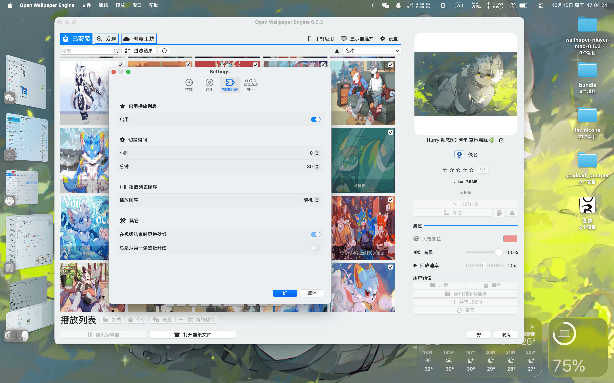
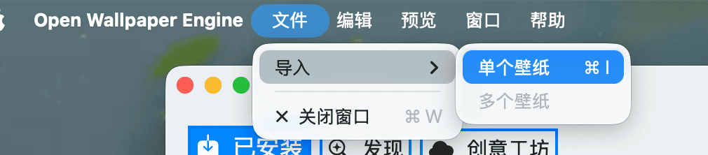
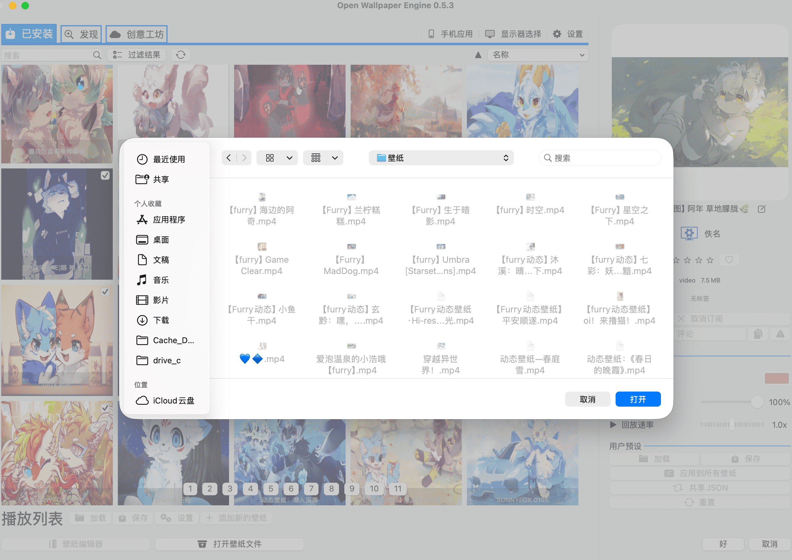

Open Wallpaper Engine - Modified
=========

一个开源的mac版仿制Wallpaper Engine

=========

### 壁纸

### UI

## 安装方法
下载`.zip`文件，解压后拖动`.app`到`/Applications`文件夹

## 用法

### 导入 Wallpaper Engine 文件

点击文件菜单

选择 Wallpaper Engine 中的壁纸文件，目前仅支持视频类型的壁纸

正确的文件夹结构应该是这样的 (视频壁纸):
- 壁纸文件夹
  - 壁纸名.mp4
  - project.json
  - preview.gif

#### 导入本地 mp4 文件

选择你的视频文件，可以同时选择多个文件导入

将文件拖动到 Open Wallpaper Engine 主界面

#### 注意

请不要重复添加壁纸，这将会导致该壁纸被意外删除
